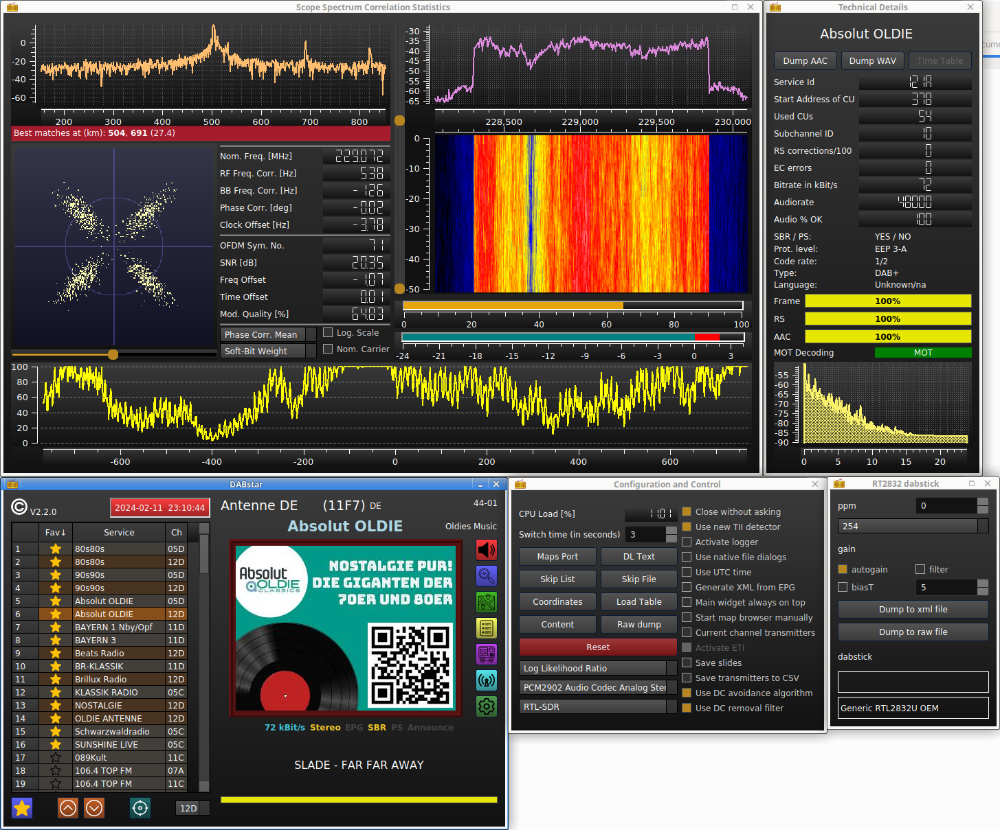

---

# DABstar

---

## Table of Content
<!-- TOC -->
  * [Table of Content](#table-of-content)
  * [Introducing](#introducing)
  * [Changes in DABstar version 1.0.2](#changes-in-dabstar-version-102)
    * [How to apply TII info](#how-to-apply-tii-info)
  * [Changes in DABstar version 1.0.1](#changes-in-dabstar-version-101-)
    * [Graphical changes](#graphical-changes)
    * [Functional changes](#functional-changes)
    * [Code refactorings](#code-refactorings)
    * [Not more working or removed things](#not-more-working-or-removed-things)
<!-- TOC -->

## Introducing

[DABstar](https://github.com/tomneda/DABstar) is forked from Jan van Katwijk's great work of [Qt-DAB](https://github.com/JvanKatwijk/qt-dab) from
[commit](https://github.com/JvanKatwijk/qt-dab/commits/b083a8e169ca2b7dd47167a07b92fa5a1970b249)
([tree](https://github.com/JvanKatwijk/qt-dab/tree/b083a8e169ca2b7dd47167a07b92fa5a1970b249))
from 2023-05-30, fixes afterwards to Qt-DAB afterwards included.

Current main branch version is [V1.0.2](#changes-in-dabstar-version-102).

As there are many changes made from my side and there will be bigger changes in the future, 
I decided to give it the new name **DABstar**.

I will try to maintain always a working state on `main` branch and do my further developement on a side branch. 

For building there is one bigger difference to Qt-DAB: I maintain only one GUI version and I provide no *.pro file for qmake anymore, only a CMakeLists.txt file.
So use only the cmake related installation process.

I will also not provide any precompiled setup packages, yet.

## Changes in DABstar version 1.0.2

- Applied latest fixes from Qt-DAB up to [commit](https://github.com/JvanKatwijk/qt-dab/commit/775dc3d9411545ecd07480f625b499f292998818) from 2023-08-13.
- Minor changes in GUI.
- Further different class refinements.
- Handling of the TII distance info improved

### How to apply TII info

That the name, distance and direction to the transmitter can be shown, do following:

1) Provide your home coordinates with button **Coordinates** on the "Configuraton and Control" windows.
2) Copy **libtii-lib.so** from project sub folder **/tii-library** to **/usr/local/lib/**    (you will need sudo rights).
3) Press one time **Load Table** on the "Configuraton and Control" window.
4) If 3) should fail you can unzip the content of **/tii-library/tiiFile.zip** to your home folder. Restart DABstar. 
    Here you will maybe not have the newest in 3) downloaded version of the data base.

## Changes in DABstar version 1.0.1 

**Qt 5.15.2** is used for build.

### Graphical changes

- Added the correlation graph together with the spectrum/waterfall view.  
- Below the correlation graph it is shown the relative distance in kilometers and miles behind the second (and more) matched markers. 
- The IQ diagram is updated faster and lets show the data in logarithmic and linear scale (switchable).
- There is a new *Phase vs. Carrier* graph which shows the decoded phase component of each of the OFDM carrier. 
- Exchange the Qt-DAB color selector with the more flexible Qt color selector.
- Adapt the looking of the GUI (adapt style sheet).
- New desktop logos for program symbol. The main window symbol is brighter in the task bar to distinguish it from the other sub windows more easily.
- Simplify clock and runtime display.
- New DAB logo on pause slide:  
    

### Functional changes

- Faster establishment to a new DAB channel (maybe this *could* be bad in poor receiving conditions).
- No modal message boxes anymore if a channel or service establishment fails. The message is shown red colored in the main window instead.
- Introduce a state machine in DAB processor to get rid of the `goto` and make the code more readable (imo).
- Fine phase adjustment in OFDM decoder (the "cross" in the IQ diagram should now looking balanced if it was not before).
- Many minor changes I almost forgot. :blush:

### Code refactorings

*(with RTL-SDR, HackRf, SdrPlay device libs included, other device libs not touched yet)*

- Do many code refactories regarding better readability (in my opinion) and higher compile speed (removing obsolete headers and code).
- Remove all gcc warnings.
- Find deep `std::vector` copies at method interfaces and replace them with const reference vectors.
- Find non-const input C array pointers and turned them to const (while this I found an unwanted memory changing issue which probably had no side effect).
- Use SonarLint on some code parts (this leads to e.g. using `std::array` templates).
- Make the FFT part to an own lib (was experimental and not really necessary).

### Not more working or removed things

- Coloring each button with an individual color is not more possible (took a huge amount of code).
- Remove obsolete code (with no functional lack).
- Remove the timer behind the mute button (I got really a shock as suddenly the muting timed out at a loud audio level :unamused: ).
- Remove the schedule feature (I had no use for that sophisticated feature and hinders doing the refactoring).
- The color selector for the graph background is removed as the stylesheet would overwrite this.

