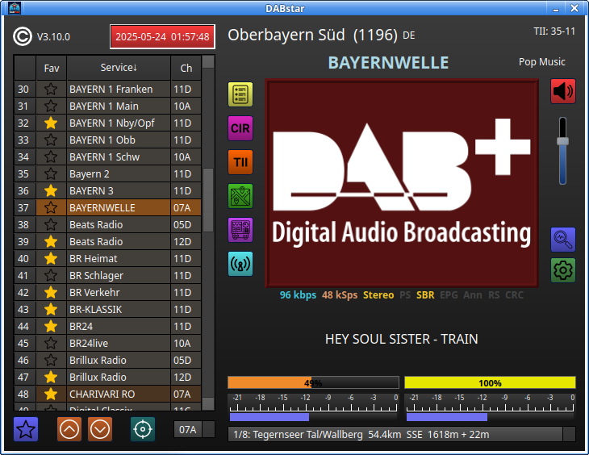
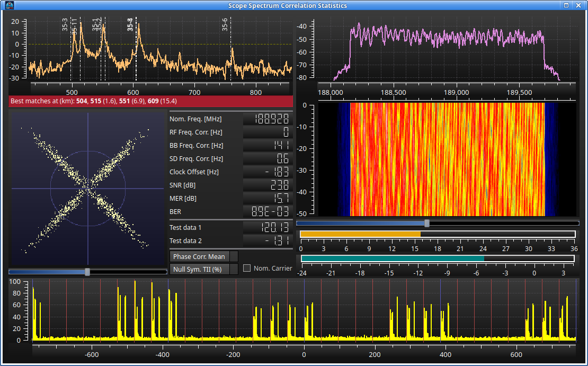
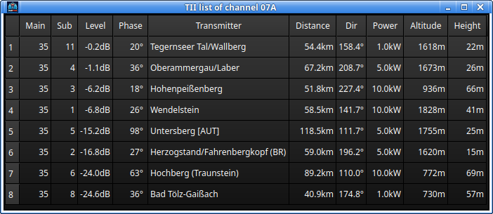
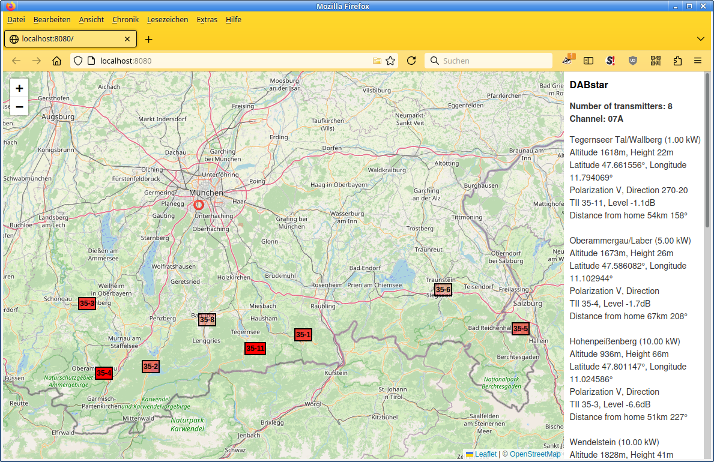
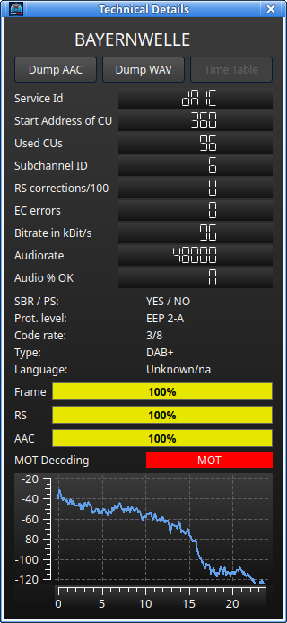
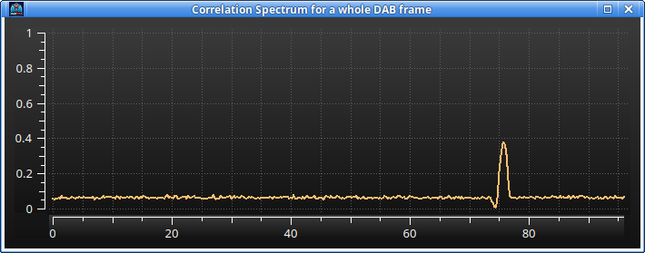
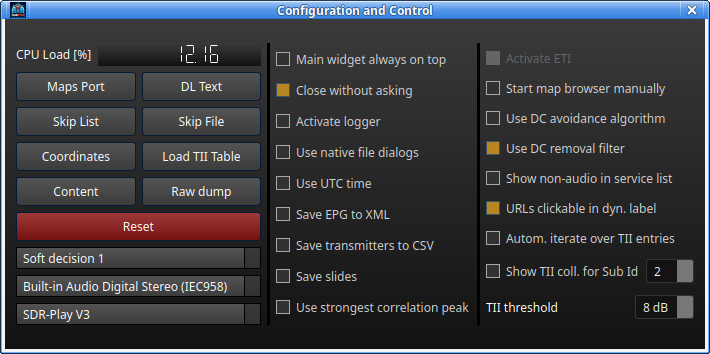
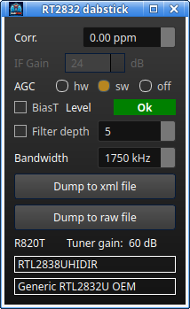
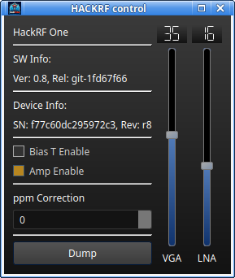
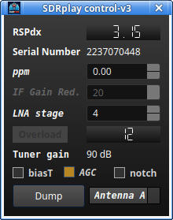

# DABstar

## Table of Content
<!-- TOC -->
* [DABstar](#dabstar)
  * [Table of Content](#table-of-content)
  * [Pictures from version V3.9.0](#pictures-from-version-v390)
    * [Main window](#main-window-)
    * [Scope Spectrum Correlation Statistic window](#scope-spectrum-correlation-statistic-window)
    * [TII-list window which shows received transmitter details](#tii-list-window-which-shows-received-transmitter-details)
    * [Map view of received transmitters](#map-view-of-received-transmitters)
    * [Technical details window of the selected service](#technical-details-window-of-the-selected-service)
    * [The PRS correlation window of a whole DAB frame (CIR)](#the-prs-correlation-window-of-a-whole-dab-frame-cir)
    * [Configuration window](#configuration-window)
    * [Some of the device windows](#some-of-the-device-windows)
  * [Releases](#releases)
  * [Introduction and history](#introduction-and-history)
  * [V3.x.y](#v3xy)
  * [Version 2.3.0 and above](#version-230-and-above)
  * [What is new in 2.2.0](#what-is-new-in-220)
  * [What is new in 2.1.0](#what-is-new-in-210)
  * [What is new in 2.0.0](#what-is-new-in-200)
    * [Buttons are icons now](#buttons-are-icons-now)
    * [Service List](#service-list)
      * [Favorites](#favorites)
      * [Sorting](#sorting)
      * [Channel Buttons](#channel-buttons)
      * [Target Button](#target-button-)
    * [Some help for scanning](#some-help-for-scanning)
  * [How to apply TII info](#how-to-apply-tii-info)
  * [Installing on Linux from current mainline](#installing-on-linux-from-current-mainline)
    * [QWT installation / building](#qwt-installation--building)
      * [Original description](#original-description)
      * [QWT short build description](#qwt-short-build-description)
    * [Building DABstar](#building-dabstar)
    * [Installing USRP UHD](#installing-usrp-uhd)
    * [Installing AirSpy](#installing-airspy)
  * [Licences](#licences)
<!-- TOC -->

---
## Pictures from version V3.9.0

### Main window                                 



### Scope Spectrum Correlation Statistic window



### TII-list window which shows received transmitter details


                       
### Map view of received transmitters



### Technical details window of the selected service



### The PRS correlation window of a whole DAB frame (CIR)



### Configuration window



### Some of the device windows

 



---

## Releases
Latest AppImage versions see
[Linux Release Page](https://github.com/tomneda/DABstar/releases/).

[old-dab](https://github.com/old-dab) provides also Windows versions, see
[Windows Release Page](https://github.com/old-dab/DABstar/releases).
The feature-set could be a bit different between Linux and Windows, even with same version number.

## Introduction and history
[DABstar](https://github.com/tomneda/DABstar) was originally forked from Jan van Katwijk's great work of [Qt-DAB](https://github.com/JvanKatwijk/qt-dab)
from [commit](https://github.com/JvanKatwijk/qt-dab/commits/b083a8e169ca2b7dd47167a07b92fa5a1970b249) ([tree](https://github.com/JvanKatwijk/qt-dab/tree/b083a8e169ca2b7dd47167a07b92fa5a1970b249)) from 2023-05-30. Some fixes and adaptions afterwards to Qt-DAB are included.

With meanwhile (not just perceived) hundreds to thousand of hours work, there are huge changes and additions (but also reductions) made and there will be bigger changes in the future,
I decided to give it the new name **DABstar**.

I saw that with starting of Qt-DAB 6.x, Qt-DAB uses also new code parts and ideas from here. I am very appreciated about this :smiley:.
This is of course very acknowledged that my work can give something back.

I will try to maintain always a working state on the head of the `main` branch, so use this for building the software for yourself.
**Please do not try any other branch besides `main` branch.**
They are indented for development, backups and tests and will not always work in their current state.

Recommended is to checkout a [Tag](https://github.com/tomneda/DABstar/tags) of a released version, these are better tested.

As this README got meanwhile quite long, I cut off the description regarding versions until 1.7.1, but you can still read
it here: [README.md of V1.7.1](https://github.com/tomneda/DABstar/blob/649431e0f5297a5f44cd7aab0c016370e010ed3e/README.md)


## V3.x.y
I and old-dab made big changes on the mainline, including the upgrade from Qt 5 to Qt 6.
So, I decided to raise the major version to 3.


## Version 2.3.0 and above

Beginning with this version, please look to the
[Release Page](https://github.com/tomneda/DABstar/releases/)
for a more detailed description of the changes.

## What is new in 2.2.0

- A bigger fix replaying files regarding my new service list. 
  There is still the small issue that the channel name does not (necessarily) fit to the file content.
- There is only one file-reading dialog now. The file type selection happens in the file dialog field. 
  It is selectable whether the QT or native file dialog should be shown.   
- Improve error checking for file handling.
- Refine the setting management. 
  This causes that the setting file (in `~/.config/dabstar/`) got a new filename. 
  So, the settings has to be put-in new.  
  Same happens to the service-list database file, so possibly already made favorites got lost.
  Sorry for that circumstance.
- Small UI refinements.
- Many small refinements under the hood.

## What is new in 2.1.0

- Some minor fixes and refinings made.
- Add status information to the main Widget, see below the MOT picture: 
  - Show the ACC decoder input bit rate.
  - Show whether Stereo mode is active.
  - Show whether EPG (Electronic Program Guide) data are available
  - Show whether SBR (Spectrum Band Replication) mode is active
  - Show whether PS (Parameter Stereo) mode is active
  - Show whether an announcement is currently made.


(move over the status elements like **SBR** or **PS** to get tooltip information)

## What is new in 2.0.0

### Buttons are icons now

I replaced all buttons on the main window to quadratic ones with icons on it. 
Some have animations or change colors or the icon itself after clicking. 
See the tooltips for further information what each button does.
         
### Service List

The major new thing is the complete new written service selector on the left side of the main window:


  
The list is stored as a SQlite database in the folder `~/.config/dabstar`. 
The list will be filled when selecting a new channel (with eg. the combobox on the right bottom corner in the picture) 
or click the "Scan" button  to scan all typical DAB channels.
While the scan is running the button is animated. 

The current selected service is shown with an orange background. 
With the brown colored entries, you will find other services from the same channel (here 11C). 
When you click on such services the switching time is quite short. 

The services with a gray background are from another channel. 
Selecting this will take a bit longer time (about 3 seconds) till audio comes up.
Note: Not each service entry has audio, especially that with SPI and EPG in its name. 

#### Favorites

You can select a current running service as a favorite by clicking . 
Click the same button again to deselect the favorite state. 
On the left side of the service list you will see an active favorite state.
The favorites are stored separately with the service list, so a re-scan would not delete them.
   
#### Sorting

When you click on the header description you can change the sorting of the columns. Selecting the "Fav" column behaves that way
that the favorites always located on the top but the service column will be sorted (ascending oder descending).

#### Channel Buttons

With the up/down-buttons  you can step one service up or down in the list (with wrap-around). 
Change the sorting of the list if you only want mainly to step within the favorites or within the same channel.

#### Target Button     

If you "lose" the orange current service selection you can click this button . 
The current service will be shown in the list center (if possible).

### Some help for scanning

For a successful reception a good leveling of the device is necessary. 
Click  to open the device widget (it differs for the different devices). 
The best feedback regarding signal quality can be seen on the **Spectrum Scope** with
. 
There, many explanations would be necessary for the details. Look at the tool tips for further help there.

For a faster signal check you would see the yellow bar 


below the picture on the main window.
This bar must reach 100% if the signal is good enough. 

Also, the clock on the top of the service list can be used as indicator. Its time is only shown (and the background light up) if the DAB time information
can be received. 


## How to apply TII info

That the location, distance and direction to the transmitter can be shown, do following:

1) Provide your home coordinates with button **Coordinates** on the "Configuraton and Control" windows.
2) Copy **libtii-lib.so** from project sub folder **/tii-library** to **/usr/local/lib/**    (you will need sudo rights).
3) Click one time **Load Table** on the "Configuraton and Control" window.
4) If 3) should fail you can unzip the content of **/tii-library/tiiFile.zip** to your home folder. Restart DABstar. 
    Here you will maybe not have the newest in 3) downloaded version of the data base.


## Installing on Linux from current mainline

This is what I needed to install DABstar on a fresh Ubuntu 24.04:
```
sudo apt-get update
sudo apt-get install git
sudo apt-get install cmake
sudo apt-get install build-essential
sudo apt-get install g++
sudo apt-get install libsndfile1-dev
sudo apt-get install libfftw3-dev
sudo apt-get install zlib1g-dev
sudo apt-get install libsamplerate0-dev
sudo apt-get install libusb-1.0-0-dev
sudo apt-get install qt6-base-dev
sudo apt-get install qt6-multimedia-dev
```

If you want to build with qmake:
```
sudo apt-get install qmake6
```

As libfaad had made issues with low rate services I switched over to FDK-AAC. 
But also the repository version in Ubuntu 24.04 has still flaws with PS (Parametric Stereo) services.
So I recommend to build it for your own. I used the latest main version which is v2.0.3.
```
git clone https://github.com/mstorsjo/fdk-aac.git
cd fdk-aac
git checkout v2.0.3
mkdir build
cd build
cmake ..
make
sudo make install
```


### QWT installation / building

It is recommended to build Qwt 6.3.0 (Qwt 6.2.0 will also work) for yourself. The library delivered with Ubuntu is quite old.

#### Original description

https://qwt.sourceforge.io/qwtinstall.html

#### QWT short build description

1. Download QWT 6.3.0: [Link](https://sourceforge.net/projects/qwt/files/qwt/6.3.0/).
2. Unzip downloaded file and go into unzipped folder.
3. comment out line "`QWT_CONFIG += QwtSvg`" with a "#" in file `qwtconfig.pri` if you have problems finding a SVG QT header file.

```
qmake6 qwt.pro
make
sudo make install`
sudo ldconfig
```
The install process installed a cmake package file to `/usr/local/qwt-6.3.0/lib/pkgconfig/Qt6Qwt6.pc`.
The path variable PKG_CONFIG_PATH in `CMakeLists.txt` refers to this path to find the Qwt-Package.

Strangely, this error can still happen:

```
...
Could not find a package configuration file provided by "Qt6Qwt6" with any
of the following names:

    Qt6Qwt6Config.cmake
    qt6qwt6-config.cmake
...
```
The package description `/usr/local/qwt-6.3.0/lib/pkgconfig/Qt6Qwt6.pc` contains this (last) line:
`Requires: Qt5Widgets Qt5Concurrent Qt5PrintSupport Qt5Svg Qt5OpenGL`, what is strange as this Qwt build was built on the base on Qt 6.

As the requirements of Qt 6 are already fulfilled, 
I could solve the issue with simply commenting out this (last) line with a hash #. 
So, the last part of the File should look like this:
```
...
Name: Qwt6
Description: Qt Widgets for Technical Applications
Version: 6.3.0
Libs: -L${libdir} -lqwt
Cflags: -I${includedir}
# Requires: Qt5Widgets Qt5Concurrent Qt5PrintSupport Qt5Svg Qt5OpenGL
```

### Building DABstar
```
git clone https://github.com/tomneda/DABstar.git
cd DABstar
mkdir build
cd build
cmake .. -DAIRSPY=ON -DSDRPLAY_V2=ON -DSDRPLAY_V3=ON -DHACKRF=ON -DLIMESDR=ON -DRTL_TCP=ON -DPLUTO=ON -DUHD=ON -DRTLSDR_LINUX=ON -DUSE_HBF=OFF -DDATA_STREAMER=OFF -DVITERBI_SSE=ON -DVITERBI_NEON=OFF -DFDK_AAC=ON
make  
```
Reduce resp. adapt the `cmake` command line for the devices/features you need.

E.G.: If you have an RTL-SDR stick and work on a desktop PC (I have only tested this on an Intel-PC), this should be the minimum recommendation:
```
cmake .. -DRTLSDR_LINUX=ON -DVITERBI_SSE=ON
```

To speed up compilation you can provide `-j<n>` as argument with `<n>` number of threads after the `make` command. E.G. `make -j4`.
Do not choose a too high number (or at my side only providing a `-j`) the system can hang due to running out memory and needed swapping!

Finally, in the build folder you can find the program file which you can start with 
```
./dabstar
```

You could try to install the software within your system with 
```
sudo make install
sudo ldconfig
```
To uninstall DABstar again, do this:
```
sudo make uninstall
```


### Installing USRP UHD

Best worked for me was building UHD from the repository of Ettus Research.

```
sudo add-apt-repository ppa:ettusresearch/uhd
sudo apt-get update
sudo apt-get install libuhd-dev uhd-host
```

### Installing AirSpy

Details see https://github.com/airspy/airspyone_host

```
git clone https://github.com/airspy/airspyone_host.git
cd airspyone_host
mkdir build
cd build
cmake ../ -DINSTALL_UDEV_RULES=ON
make
sudo make install
sudo ldconfig
```

## Licences

Rights of Qt-DAB, AbracaDABra, Qt, Qwt, FFTW, VOLK, FDK-AAC, libfaad, libsamplerate and libsndfile gratefully acknowledged.

Rights of developers of RTLSDR library, SDRplay libraries, AIRspy library and others gratefully acknowledged.

Rights of other contributors gratefully acknowledged.

As I use some icons, I get them from [FlatIcon](https://www.flaticon.com/). The work of the icon authors is very acknowledged: 
- <a href="https://www.flaticon.com/free-icons/electromagnetic" title="Electromagnetic icons">Electromagnetic icons created by muh zakaria - Flaticon</a>
- <a href="https://www.flaticon.com/free-icons/radio-tower" title="radio tower icons">Radio tower icons created by sonnycandra - Flaticon</a>
- <a href="https://www.flaticon.com/free-icons/frequency" title="frequency icons">Frequency icons created by DinosoftLabs - Flaticon</a>
- <a href="https://www.flaticon.com/free-icons/spectrum" title="spectrum icons">Spectrum icons created by JunGSa - Flaticon</a>
- <a href="https://www.flaticon.com/free-icons/spectrum" title="spectrum icons">Spectrum icons created by Eucalyp - Flaticon</a>
- <a href="https://www.flaticon.com/free-icons/target" title="target icons">Target icons created by Pixel perfect - Flaticon</a>
- <a href="https://www.flaticon.com/free-icons/eject-button" title="eject button icons">Eject button icons created by Yudhi Restu - Flaticon</a>